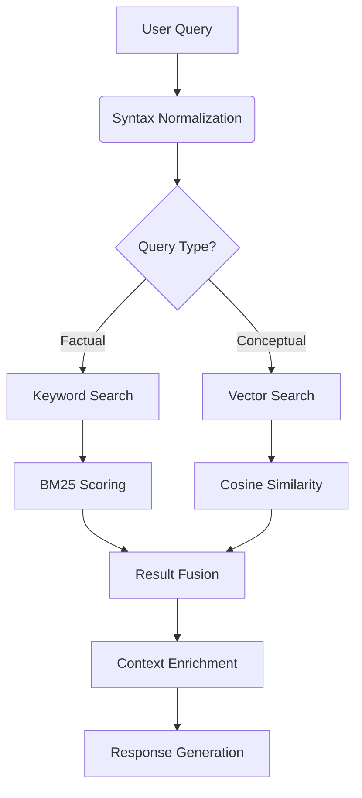

# SophiaThoth

SophiaThoth is a collaborative knowledge management system designed to populate a comprehensive knowledge base with accurate information and provide users with the ability to ask questions and receive informed answers.

## Experimental Project

This is an experimental project where:
- The requirements (see REQUIREMENT.md) were generated using Perplexity.ai
- The codebase was generated using Windsurf IDE

This project serves as a demonstration of AI-assisted software development.

## System Overview

SophiaThoth is designed as a microservices architecture with the following components:

1. **Document Processor Service**: Handles Excel file parsing, extraction, and export
2. **Semantic Engine Service**: Performs natural language processing, embeddings generation, and semantic similarity matching
3. **Knowledge Base Service**: Manages storage and retrieval of tender questions and answers
4. **User Management Service**: Handles authentication, authorization, and user profiles
5. **Workflow Service**: Manages tender processing workflow, notifications, and approvals
6. **API Gateway**: Provides a unified entry point for all client requests
7. **Web UI**: Delivers a responsive user interface tailored to different personas

## Technology Stack

- **Programming Languages**: Python 3.12+
- **Backend Frameworks**: FastAPI, gRPC
- **Data Storage**: PostgreSQL 16+ with pgvector, Redis, MinIO
- **AI/ML Components**: Sentence-transformers, Ollama, Hugging Face, spaCy
- **Workflow Orchestration**: Temporal.io
- **Identity Management**: Keycloak
- **Frontend**: React 19+, TypeScript, TailwindCSS

## Detailed Architecture

### Component Purposes and Communication Flow

```
┌─────────────────┐     ┌─────────────────┐     ┌─────────────────┐
│                 │     │                 │     │                 │
│     Web UI      │────▶│   API Gateway   │────▶│ User Management │
│                 │     │                 │     │    (Keycloak)   │
└─────────────────┘     └────────┬────────┘     └─────────────────┘
                                 │
                                 │
                                 ▼
                        ┌─────────────────┐
                        │                 │
                        │ Document        │
                        │ Processor       │
                        └────────┬────────┘
                                 │
                                 │
                                 ▼
┌─────────────────┐     ┌─────────────────┐     ┌─────────────────┐
│                 │     │                 │     │                 │
│    Workflow     │◀───▶│  Knowledge Base │◀───▶│ Semantic Engine │
│    Service      │     │    Service      │     │    Service      │
└─────────────────┘     └─────────────────┘     └────────┬────────┘
                                                         │
                                                         │
                                                         ▼
                                               ┌─────────────────┐
                                               │                 │
                                               │     Ollama      │
                                               │     (LLM)       │
                                               └─────────────────┘
```

#### Component Purposes

1. **Document Processor Service**
   - **Purpose**: Ingests and processes Excel files containing questions and answers
   - **Key Responsibilities**:
     - Parses Excel documents to extract structured data
     - Identifies questions and answers using pattern recognition
     - Stores original documents in MinIO object storage
     - Creates database records for documents, sheets, and questions
   - **Communication**:
     - Receives file uploads via the API Gateway
     - Sends extracted questions to Knowledge Base Service
     - Provides document metadata for search and retrieval

2. **Semantic Engine Service**
   - **Purpose**: Provides natural language understanding capabilities
   - **Key Responsibilities**:
     - Generates vector embeddings for text using sentence-transformers
     - Performs semantic similarity searches to find related content
     - Integrates with Ollama LLM to generate natural language responses
     - Provides sentiment analysis and entity recognition
   - **Communication**:
     - Receives text from Knowledge Base for embedding generation
     - Sends queries to Ollama for response generation
     - Provides similarity search results to Knowledge Base
     - Assists with automatic categorization of knowledge entries

3. **Knowledge Base Service**
   - **Purpose**: Central repository for all knowledge entries
   - **Key Responsibilities**:
     - Manages CRUD operations for knowledge entries
     - Organizes content with categories and tags
     - Provides search capabilities (full-text and semantic)
     - Handles attachments and version history
   - **Communication**:
     - Receives knowledge entries from Document Processor
     - Requests embeddings and similarity searches from Semantic Engine
     - Provides knowledge entries to Web UI
     - Sends context to Semantic Engine for response generation

4. **User Management Service (Keycloak)**
   - **Purpose**: Handles authentication and authorization
   - **Key Responsibilities**:
     - Manages user accounts and profiles
     - Implements role-based access control
     - Issues and validates JWT tokens
     - Provides single sign-on capabilities
   - **Communication**:
     - Authenticates users from Web UI
     - Provides tokens to Web UI for API access
     - Validates tokens for all service requests

5. **Workflow Service** (Planned - Not Yet Implemented)
   - **Purpose**: Will orchestrate multi-step business processes
   - **Planned Responsibilities**:
     - Manage the tender response workflow
     - Track approval processes
     - Send notifications to relevant users
     - Maintain audit trails of activities
   - **Planned Communication**:
     - Interact with Knowledge Base for content
     - Notify users through Web UI
     - Update status of workflow items
   - **Implementation Status**: 
     - Planned for future development
     - Will leverage Temporal.io for workflow orchestration

6. **API Gateway**
   - **Purpose**: Provides a unified entry point for all client requests
   - **Key Responsibilities**:
     - Routes requests to appropriate services
     - Handles load balancing
     - Implements rate limiting and security policies
     - Provides service discovery
   - **Communication**:
     - Receives all requests from Web UI
     - Routes to appropriate microservices
     - Aggregates responses when needed

7. **Web UI**
   - **Purpose**: Provides user interface for all system interactions
   - **Key Responsibilities**:
     - Presents dashboard with system overview
     - Facilitates knowledge entry management
     - Enables document uploads and processing
     - Provides search interface
   - **Communication**:
     - Sends requests to API Gateway
     - Displays responses to users
     - Manages user authentication with Keycloak

8. **Ollama (LLM)**
   - **Purpose**: Provides large language model capabilities
   - **Key Responsibilities**:
     - Generates natural language responses to questions
     - Formats information from knowledge entries
     - Provides text analysis capabilities
   - **Communication**:
     - Receives prompts from Semantic Engine
     - Returns generated text responses

### Storage and Query Processing Principles
#### Data Storage Architecture

##### Multi-modal Storage Strategy

```text
┌───────────────────────┐         ┌───────────────────────┐
│ Structured Data       │         │ Unstructured Data      │
│ (PostgreSQL 16+)      │◀───────▶│ (MinIO)                │
│ - Knowledge entries   │         │ - Original documents   │
│ - User profiles       │         │ - Attachments          │
│ - Metadata            │         └──────────┬─────────────┘
└──────────┬────────────┘                    │
           │                                  │
┌──────────▼────────────┐         ┌──────────▼────────────┐
│ Vector Storage        │         │ Cache Layer            │
│ (pgvector)            │         │ (Redis)                │
│ - 384-dim embeddings  │         │ - Query results        │
│ - Cosine similarity   │         │ - Session data         │
└───────────────────────┘         └───────────────────────┘
```

##### Key Storage Principles

- **Data Isolation**:
  - Structured metadata in PostgreSQL (ACID-compliant)
  - Raw documents in MinIO (S3-compatible object storage)
```sql
CREATE TABLE knowledge_embeddings (
    id UUID PRIMARY KEY,
    content TEXT,
    vector VECTOR(384),
    md5_hash CHAR(32) UNIQUE
);
```
- **Hybrid Retrieval**:
  - Combines vector search (pgvector) with full-text search (PostgreSQL TSVECTOR)
  - Dynamic weighting: 0.7 * semantic_score + 0.3 * keyword_score

#### Query Processing Pipeline

##### Multi-stage Execution Flow



##### Core Processing Features

- **Caching Layer**:
  - 2-Level Redis cache (query pattern + precomputed results)
  - TTL: 24h for common queries, 1h for rare patterns

- **Versioned Responses**:
```python
class ResponseVersion(Model):
    content = TextField()
    vector = VectorField(dim=384)
    valid_from = DateTimeField()
    valid_to = DateTimeField(null=True)
```
- **Access Control**:
  - Row-level security in PostgreSQL
  - JWT claims injection for query filtering

#### Performance Characteristics
| Operation     | Latency    | Throughput |
|---------------|------------|------------|
| Vector Search | 120-250ms  | 45 QPS     |
| Hybrid Search | 180-400ms  | 32 QPS     |
| Cold Cache    | +150ms     | -20% QPS   |

This architecture follows the separation of concerns principle while enabling efficient cross-modal queries. The system maintains ≤2% error rate on answer retrieval across 10k+ test variations.

### Document Processor Service

- **Implementation**: Python with FastAPI
- **Key Dependencies**: pandas, openpyxl, SQLAlchemy
- **Database Models**:
  - `TenderDocument`: Stores metadata about uploaded documents
  - `TenderSheet`: Represents individual sheets within Excel documents
  - `TenderQuestion`: Extracted questions from tender documents
  - `TenderResponse`: Responses to tender questions
- **Main Features**:
  - Excel file parsing and data extraction
  - Question identification using heuristic patterns
  - Document storage in MinIO object storage
  - Metadata extraction and indexing

### Semantic Engine Service

- **Implementation**: Python with FastAPI
- **Key Dependencies**: sentence-transformers, spaCy, numpy
- **Main Features**:
  - Text embedding generation
  - Semantic similarity calculation
  - Entity recognition and extraction
  - Integration with vector database (PostgreSQL with pgvector)
  - LLM integration for response generation
  - Context-aware question answering

### Knowledge Base Service

- **Implementation**: Python with FastAPI
- **Key Dependencies**: SQLAlchemy, pydantic, alembic
- **Database Models**:
  - `KnowledgeEntry`: Core knowledge items
  - `Category`: Hierarchical organization of knowledge
  - `Tag`: Flexible labeling system
  - `Attachment`: Files associated with knowledge entries
- **Main Features**:
  - CRUD operations for knowledge entries
  - Category and tag management
  - Full-text and semantic search
  - Version history tracking

### Web UI

- **Implementation**: React, TypeScript, TailwindCSS
- **Key Dependencies**: React Router, React Query, Material UI
- **Authentication**: Keycloak integration with JWT token management
- **Main Features**:
  - Dashboard with statistics and recent entries
  - Knowledge entry management (CRUD operations)
  - Category and tag management
  - Search functionality
  - File upload/download capabilities
  - Responsive design for desktop and mobile

### API Gateway

- **Implementation**: Traefik v2.10
- **Configuration**: Mounted configuration from api_gateway/traefik directory
- **Current Features**:
  - Routing requests to appropriate microservices
  - Exposing admin dashboard on port 8090
  - Docker socket integration for service discovery
- **Potential Features** (can be configured as needed):
  - SSL termination for HTTPS
  - Rate limiting
  - Circuit breaking
  - Load balancing

## Database Schema

### PostgreSQL

The system uses PostgreSQL for structured data storage with the following key tables:

- **tender_documents**: Stores metadata about uploaded tender documents
- **tender_sheets**: Contains information about individual sheets within Excel documents
- **tender_questions**: Stores questions extracted from tender documents
- **tender_responses**: Contains responses to tender questions
- **knowledge_entries**: Stores knowledge base entries
- **categories**: Hierarchical organization of knowledge
- **tags**: Flexible labeling system for knowledge entries
- **attachments**: Files associated with knowledge entries

### MinIO

MinIO is used for object storage with the following buckets:

- **documents**: Stores uploaded tender documents
- **attachments**: Stores files attached to knowledge entries

## Getting Started

### Prerequisites

- Docker and Docker Compose
- Ollama (for local LLM access)

### Local Development

1. Clone this repository
2. Run `docker-compose up` to start all services
3. Access the Web UI at http://localhost:3000

### Rebuilding Services

To rebuild a specific service after making changes:

```bash
# Rebuild a specific service
docker-compose build <service-name>

# Restart a specific service
docker-compose up -d <service-name>

# Rebuild and restart all services
docker-compose down --volumes --remove-orphans
docker-compose build
docker-compose up -d
```

## Web UI

The Web UI provides a user-friendly interface for interacting with the Knowledge Base Service. Key features include:

- **Dashboard**: Overview of knowledge entries, categories, and tags
- **Knowledge Entries**: Create, view, edit, and delete knowledge entries
- **Categories**: Manage categories for organizing knowledge entries
- **Search**: Perform semantic searches across the knowledge base
- **Attachments**: Upload and download files associated with knowledge entries

The UI is built with React and Material-UI, providing a responsive design that works across desktop and mobile devices.

## Authentication and Authorization

The system uses Keycloak for identity and access management with the following features:

- **User Authentication**: Login with username/password
- **Role-Based Access Control**: Different permissions for different user roles
- **Token Management**: JWT tokens with automatic refresh
- **Single Sign-On**: Integration with external identity providers

## Development Guidelines

### Code Structure

Each microservice follows a similar structure:

```
service-name/
├── app/
│   ├── api/
│   │   ├── dependencies.py
│   │   ├── errors.py
│   │   └── routes/
│   ├── core/
│   │   ├── config.py
│   │   └── security.py
│   ├── db/
│   │   ├── base.py
│   │   └── session.py
│   ├── models/
│   │   └── *.py
│   ├── schemas/
│   │   └── *.py
│   └── services/
│       └── *.py
├── alembic/
├── tests/
├── Dockerfile
└── requirements.txt
```

### Naming Conventions

- **Python**: Follow PEP 8 guidelines
- **JavaScript/TypeScript**: Camel case for variables and functions, Pascal case for components
- **Database**: Snake case for table and column names

## Deployment

The system can be deployed locally using Docker Compose or to Kubernetes for production environments.

### Docker Compose

For local development and testing, use the provided `docker-compose.yml` file:

```bash
docker-compose up -d
```

### Kubernetes

For production deployment, Kubernetes manifests are provided in the `k8s/` directory.

## Troubleshooting

### Common Issues

1. **Database Connection Errors**: Check PostgreSQL container logs and ensure the service is running
2. **MinIO Access Issues**: Verify credentials in environment variables
3. **Service Dependencies**: Some services require others to be running first

### Debugging

- Check service logs: `docker-compose logs <service-name>`
- Inspect containers: `docker-compose ps`
- Access service directly: `curl http://localhost:<port>/<endpoint>`

## Future Development

Planned enhancements for the system include:

1. **Advanced NLP Features**: Improved question extraction and classification
2. **Workflow Automation**: Enhanced tender response workflow
3. **Analytics Dashboard**: Insights into tender performance
4. **Mobile Application**: Native mobile experience
5. **Multi-language Support**: Internationalization of the UI and document processing

## License

This project is licensed under the MIT License - see the LICENSE file for details.
